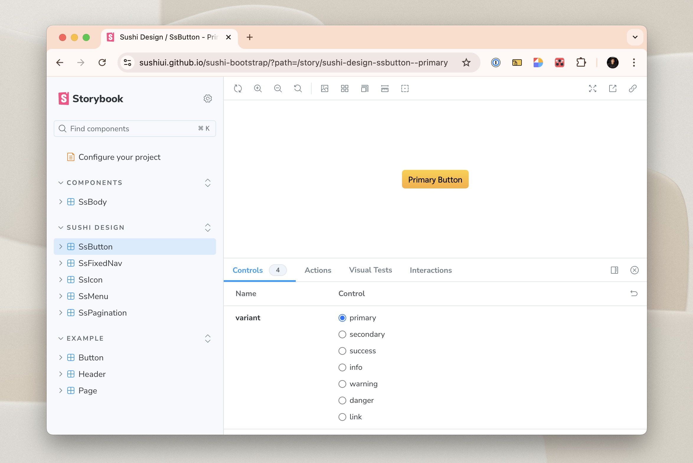

# Sushi Bootstrap

### What is Sushi?

Sushi Design System is designed to create seamless collaboration across teams, providing the tools to build outstanding user experiences for SET co-workers and listed companies.

- **Developers:** Access pre-built HTML/CSS components to speed up product and feature development.
- **Designers:** Utilize Figma components for prototype creation.

Main Sushi repository: [Sushi HTML/CSS Components](https://github.com/sushiui/sushi)

---

## About This Project

Bootstrap Sushi is a project aimed at providing a streamlined and efficient way to integrate Bootstrap components into your web applications. This project simplifies the process of building responsive and visually appealing web pages.

- Easy integration of Bootstrap components
- Pre-designed templates for quick setup
- Customizable styles and themes
- Responsive design out of the box

Repository: [Bootstrap Sushi Repository](https://github.com/sushiui/sushi-bootstrap)

---

## Storybook page

You can access the Storybook page to view the components and their usage.



📕 [Storybook](https://sushiui.github.io/sushi-bootstrap/)

## How to Use

Add `.npmrc` file to the root of your project and add the following line:

```sh
@ensset:registry=https://git.alm.set/api/v4/projects/4764/packages/npm/
//git.alm.set/api/v4/projects/4764/packages/npm/:_authToken=CI_TOKEN
```

Then add the following line to your `package.json` file:

```
"@ensset/bootstrap-sushi": "0.0.14",
```

Run roll up

```sh
npm run rollup
```

## Contribute

To get started with Bootstrap Sushi, clone the repository and follow the instructions in the documentation.

```bash
git clone https://git.alm.set/ens/bootstrap-sushi
cd bootstrap-sushi
```

### Running the Storybook

Start the Storybook development environment to preview components.

```bash
npm run storybook
```

## Contact

For any questions or feedback, please open an issue in the repository or contact the maintainers.

Happy coding with Bootstrap Sushi!
